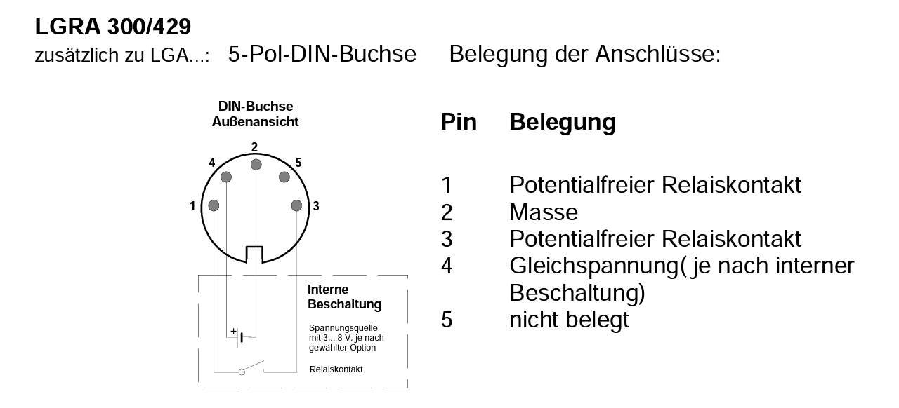

# PagerAlert

Secondary alarm in addition to the digital radio message receiver on the mobile phone by telegram

<!-- TOC -->

- [PagerAlert](#pageralert)
    - [FEATURES](#features)
    - [REQUIREMENTS](#requirements)
    - [INSTALL AND USAGE](#install-and-usage)
        - [PINOUT](#pinout)
        - [SWISSPHONE LGRA 300/429 5-POLE DIN CONNECTOR](#swissphone-lgra-300429-5-pole-din-connector)
        - [LIBRARIES (#libraries-)
    - [DIRECTORIES AND FILES](#directories-and-files)
    - [AUTOMATION WITH NODE-RED](#automation-with-node-red)
        - [PLUGIN REQUIREMENTS](#plugin-requirements)
        - [NODE-RED FLOW](#node-red-flow)
        - [MQTT TOPICS](#mqtt-topics)
    - [LICENSE](#license)

<!-- /TOC -->

## FEATURES

- Connects to the Wireless Access Pointt / Wifi Router
- Securely connects to the MQTT Broker (TLS)
- Controls ESP8266 Chip Level Data Pins
- Sends a heartbeat signal to the MQTT broker periodically
- Is supplied with power from the charging station of the Swissphone Radio Pager receiver
- Taps the potential-free relay contact when an alarm is triggered and sends a signal to a GPIO of the Arduino
- Sends the relay status via MQTT to the broker (on/off)

## REQUIREMENTS

- A radio message receiver (Swissphone BOSS 925 in this case)
- Compatible charging cradle with DIN Sub-5 connector
- Wemos D1 Mini (should work with other Arduino microcontrollers too)
- WiFi infrastructure and Internet connection
- PlatformIO or Arduino IDE (for Arduino IDE you have to move files from /src to root-folder)
- MQTT Broker such as the Mosquitto MQTT Broker (https://mosquitto.org/)
- Telegram Account and App from the Appstore https://play.google.com/store/apps/details?id=org.telegram.messenger&hl=en
- Some time to study the API https://core.telegram.org/

## INSTALL AND USAGE

### PINOUT

| Sensor-Description | Sensor-PIN | PIN-Description | Arduino Port| Comment |
| --- | --- | --- | --- | --- |
| DIN Sub-5 Cable | 1/5 BLUE | Relay contact | - | To Arduino GND to switch pulldown at relay contact | - |
| DIN Sub-5 Cable | 2/5 WHITE	| Energy source for Arduino (+) 3-8V| USB-Port Arduino 3-8 V | 3-8 volts depending on the internal assignments of the Swissphone charging station (solder bridges) |
| DIN Sub-5 Cable | 3/5	COPPER | Energy source for Arduino (-) GND | USB-Port Arduino GND |
| DIN Sub-5 Cable | 4/5 GREEN	| N/A	| - |	- |
| DIN Sub-5 Cable | 5/5	RED | Relay contact | - | Bridged to Arduino D3 PIN  |
| Arduino | - | - | D3 | From D3 to Relay contact to GND - Input with pullup - so you dont need an external resistor |

### SWISSPHONE LGRA 300/429 5-POLE DIN CONNECTOR

The following is a schematic drawing from the instructions guide of the Pager for the DIN connector

### LIBRARIES

- PubSubClient by Nick O'Leary
- esp8266_mdns by dunk

## DIRECTORIES AND FILES

- src/PagerAlert.ino - The main programm code
- src/config.h - GPIO configuration, definition of threshold values, etc.
- src/credentials.h.sample - Sample configuration file for WiFi and MQTT credentials (please rename to secrets.h)
- README.md - The manual for this Arduino Script
- LICENSE - The license notes for this Arduino script
- platformio.ini - Wemos D1 Mini Configuration for PlatformIO

## AUTOMATION WITH NODE-RED

### PLUGIN REQUIREMENTS

### NODE-RED FLOW

Node-RED works with so-called flows, which can be imported and exported. 
An example of a flow can be found in **flows.json** in the github repository.

### MQTT TOPICS

| MQTT Topic | Description | Possible values |
| --- | --- | --- |
| home/pager/alert | Status of the potential-free relay contact (sends on when the Pager is triggered) | on, off |
| home/pager/alert/heartbeat | Heartbeat for troubleshooting | on |
| home/pager/alert/status | Timebased status for MQTTDash dashboard | on, off |

## LICENSE

PagerAlert and all individual scripts are under the BSD 3-Clause license unless explicitly noted otherwise. Please refer to the LICENSE
